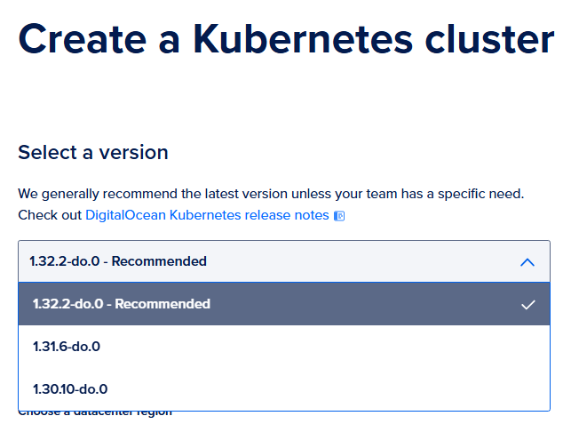

# Kubernetes Cluster on DigitalOcean with Terraform

This repository contains Terraform code to provision a Kubernetes cluster with 4 nodes on DigitalOcean. It automates the infrastructure setup, ensuring a consistent and reproducible environment.

## Table of Contents

- [Kubernetes Cluster on DigitalOcean with Terraform](#kubernetes-cluster-on-digitalocean-with-terraform)
  - [Table of Contents](#table-of-contents)
  - [Infrastructure as Code (IaC)](#infrastructure-as-code-iac)
  - [Repository Structure](#repository-structure)
  - [Prerequisites](#prerequisites)
  - [Setup Instructions](#setup-instructions)
    - [1. Clone the Repository](#1-clone-the-repository)
    - [2. Configure Variables](#2-configure-variables)
    - [3. Configure Kubernetes Version](#3-configure-kubernetes-version)
    - [4. Deploy with Terraform](#4-deploy-with-terraform)
  - [Outputs](#outputs)
  - [Clean Up](#clean-up)
    - [Using Terraform](#using-terraform)
    - [Using Makefile](#using-makefile)
    - [Manual Cleanup](#manual-cleanup)
  - [Contributing](#contributing)
  - [License](#license)

## Infrastructure as Code (IaC)

This project is part of a larger infrastructure setup. You can find the related repositories here:

- **Edge Environment**: [https://github.com/ArthurKretzer/edge-k8s-iac](https://github.com/ArthurKretzer/edge-k8s-iac)
- **Cloud Environment (This Repository)**: [https://github.com/ArthurKretzer/digitalocean-k8s-iac](https://github.com/ArthurKretzer/digitalocean-k8s-iac)

## Repository Structure

Here is a brief overview of the key files in this repository:

- `provider.tf`: Configures the DigitalOcean Terraform provider.
- `env.tfvars`: (Not committed) Variable definitions file for sensitive/custom configuration.
- `Makefile`: Helper commands for common tasks (e.g., cleaning up).
- `LICENSE`: Apache License v2.0.

## Prerequisites

Before you begin, ensure you have the following installed and configured:

- **Terraform**: [Install Terraform](https://www.digitalocean.com/community/tutorials/how-to-use-terraform-with-digitalocean#step-1-installing-terraform)
- **DigitalOcean API Token**: [Create a Personal Access Token](https://docs.digitalocean.com/reference/api/create-personal-access-token/)
- **doctl** (Optional but recommended): [Install DigitalOcean CLI](https://docs.digitalocean.com/reference/doctl/how-to/install/)
- **kubectl** (Optional): [Install kubectl](https://kubernetes.io/docs/tasks/tools/)

## Setup Instructions

### 1. Clone the Repository

```bash
git clone https://github.com/arthurkretzer/digitalocean-k8s-iac.git
cd digitalocean-k8s-iac
```

### 2. Configure Variables

Create a `env.tfvars` file in the root directory and add your specific configuration. This file is ignored by git to protect your secrets.

```hcl
do_token  = "your_digitalocean_token"
region    = "nyc1"
node_size = "s-4vcpu-16gb"
```

### 3. Configure Kubernetes Version

Identify the available Kubernetes version on the DigitalOcean UI or via CLI (`doctl kubernetes options versions`). Update the version in your Terraform configuration (e.g., in `main.tf` or as a variable).



Example configuration:

```hcl
resource "digitalocean_kubernetes_cluster" "k8s_cluster" {
    name    = "k8s-cluster"
    region  = var.region
    version = "1.32.2-do.0"
    # ...
}
```

### 4. Deploy with Terraform

Initialize Terraform, view the plan, and apply the changes to create your cluster.

```bash
terraform init
terraform plan -var-file="env.tfvars"
terraform apply -var-file="env.tfvars"
```

## Outputs

After a successful application, Terraform will output:

- **Cluster ID**: The ID of the created Kubernetes cluster.
- **Kubeconfig**: A `kubeconfig.yaml` file will be generated in the local directory. You can use this to access your cluster via `kubectl`.
- **Cluster Endpoint**: The URL of the Kubernetes API server.

## Clean Up

To destroy the infrastructure and avoid incurring charges, you can use Terraform or the provided Makefile.

### Using Terraform

```bash
terraform destroy -var-file=env.tfvars
```

### Using Makefile

If you have `make` installed, you can simply run:

```bash
make clean
```

> **Warning**: This will destroy the Kubernetes cluster and **all** droplets in your DigitalOcean account, as well as **all** PVCs. Use with caution.

### Manual Cleanup

In some cases, worker droplets might not be automatically destroyed. You can manually delete them via the DigitalOcean dashboard or using `doctl`:

```bash
# Authenticate
doctl auth init

# List and delete droplets
for id in $(doctl compute droplet list --format ID --no-header); do doctl compute droplet delete $id --force; done
```

## Contributing

Contributions are welcome! Please feel free to submit a Pull Request.

## License

This project is licensed under the Apache License v2.0. See the [LICENSE](LICENSE) file for details.
