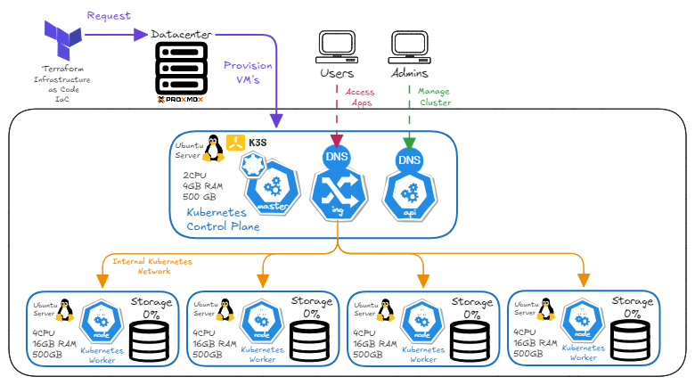

# Edge K8s IaC with Terraform

This repository contains the Infrastructure-as-Code (IaC) configuration for provisioning a Kubernetes (K3s) cluster on Proxmox VE using Terraform. It automates the creation of virtual machines and the deployment of a K3s cluster, including master and worker nodes.

## Table of Contents

- [Architecture](#architecture)
- [Prerequisites](#prerequisites)
- [Installation](#installation)
- [Configuration](#configuration)
- [Usage](#usage)
- [Cloud-Init Template](#cloud-init-template-configuration)

## Architecture



The infrastructure consists of:

- **Proxmox VE**: The virtualization platform.
- **Terraform**: The tool for provisioning infrastructure.
- **K3s**: A lightweight Kubernetes distribution.
- **Ubuntu 20.04**: The base operating system for the nodes.

## Prerequisites

Before you begin, ensure you have the following:

- **Proxmox VE 7.x/8.x** cluster or standalone node.
- **Terraform v1.0+** installed on your local machine.
- **SSH Access** to the Proxmox server.
- A **Cloud-Init ready Ubuntu 20.04 image** template on Proxmox.

## Installation

### Install Terraform

#### Ubuntu/Debian

1. **Update package list and install dependencies:**

    ```bash
    sudo apt-get update && sudo apt-get install -y gnupg software-properties-common curl
    ```

2. **Add HashiCorp's GPG key:**

    ```bash
    curl -fsSL https://apt.releases.hashicorp.com/gpg | sudo gpg --batch --yes --dearmor -o /usr/share/keyrings/hashicorp-archive-keyring.gpg
    ```

3. **Add the HashiCorp repository:**

    ```bash
    echo "deb [signed-by=/usr/share/keyrings/hashicorp-archive-keyring.gpg] https://apt.releases.hashicorp.com $(lsb_release -cs) main" | sudo tee /etc/apt/sources.list.d/hashicorp.list
    ```

4. **Install Terraform:**

    ```bash
    sudo apt-get update && sudo apt-get install terraform
    ```

5. **Verify installation:**

    ```bash
    terraform -v
    ```

### Initialize Project

Initialize Terraform to download the required providers:

```bash
terraform init
```

## Configuration

Create a `secret.tfvars` file in the root directory to store sensitive information. **Do not commit this file to version control.**

**Example `secret.tfvars`:**

```hcl
proxmox_api_token_id     = "user@pam!token_id"
proxmox_api_token_secret = "your-api-token-secret"
ssh_user                 = "ubuntu"
ssh_port                 = "22"
cipassword               = "secure-vm-password"
new_cluster_name         = "my-k3s-cluster"
```

### Variables Description

| Variable | Description |
| :--- | :--- |
| `proxmox_api_token_id` | Proxmox API Token ID (e.g., `user@pam!token`). |
| `proxmox_api_token_secret` | Proxmox API Token Secret. |
| `ssh_user` | SSH user for the VMs (must be in sudoers). |
| `ssh_port` | SSH port for the VMs (usually 22). |
| `cipassword` | Password for the `ssh_user` (set via Cloud-Init). |
| `new_cluster_name` | Name of the Kubernetes cluster. |

### Proxmox API Token

To generate an API token:

1. Go to **Datacenter > Permissions > API Tokens**.
2. Click **Add**.
3. Select the user and enter a Token ID.
4. Uncheck "Privilege Separation" if necessary (depends on your permissions setup).
5. Copy the Secret immediately.

## Usage

### Plan Infrastructure

Preview the changes Terraform will make:

```bash
terraform plan -var-file="secret.tfvars"
```

### Apply Configuration

Provision the infrastructure:

```bash
terraform apply -var-file="secret.tfvars"
```

### Destroy Infrastructure

To tear down the infrastructure:

```bash
terraform destroy -var-file="secret.tfvars"
```

## Cloud-Init Template Configuration

To create the base template required by this project:

1. **Download the image** (on Proxmox host):

    ```bash
    wget https://cloud-images.ubuntu.com/focal/current/focal-server-cloudimg-amd64.img
    ```

2. **Create a VM:**

    ```bash
    # Create VM ID 9000
    qm create 9000 --memory 2048 --net0 virtio,bridge=vmbr0 --scsihw virtio-scsi-pci
    
    # Import disk
    qm set 9000 --virtio0 local-zfs:0,import-from=/root/focal-server-cloudimg-amd64.img
    
    # Add Cloud-Init drive
    qm set 9000 --ide2 local-zfs:cloudinit
    
    # Set boot order
    qm set 9000 --boot order=virtio0
    
    # Set BIOS to UEFI (optional, but recommended for modern setups)
    qm set 9000 --bios ovmf
    ```

3. **Install QEMU Guest Agent:**

    Start the VM, install the agent, and shut it down.

    ```bash
    sudo apt-get update
    sudo apt-get install qemu-guest-agent
    ```

4. **Convert to Template:**

    ```bash
    qm template 9000
    ```

---
**Note:** Ensure your `main.tf` references the correct template name (`clone` parameter) and target node.
